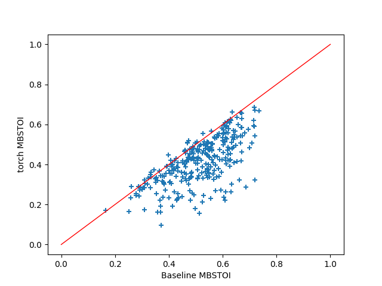
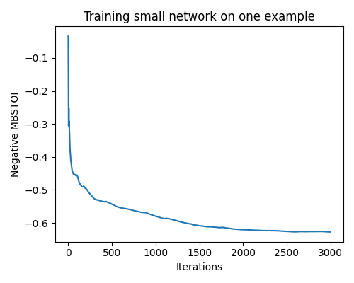

# PyTorch implementation of MSBG hearing loss model and MBSTOI intelligibility metric
This repository contains the implementation of MSBG hearing loss model and MBSTOI intellibility metric in PyTorch. The models are differentiable and can be used as a loss function to train a neural network. Both models follow Python implementation of MSBG and MBSTOI provided by organizers of Clarity Enhancement challenge. Please check the implementation at [Clarity challenge repository](https://github.com/claritychallenge/clarity_CEC1) for more information about the models.

Please note that the differentiable models are approximations of the original models and are intended to be used to train neural networks, not to give exactly the same outputs as the original models.

## Requirements and installation
The model uses parts of the functionality of the original MSBG and MBSTOI models. First, download the [Clarity challenge repository](https://github.com/claritychallenge/clarity_CEC1) and set its location as `CLARITY_ROOT`. To install the necessary requirements:
```
pip install -r requirements.txt
pushd .
cd $CLARITY_ROOT/projects/MSBG/packages/matlab_mldivide
python setup.py install
popd
```

Additionally, set paths to the Clarity repository and this repository in `path.sh` and run the `path.sh` script before using the provided modules.
```
. path.sh
```

## Tests and example script
Directory `tests` contains scipts to test the correspondance of the differentiable modules compared to their original implementation. To run the tests, you need the Clarity data, which can be obtained from the [Clarity challenge repository](https://github.com/claritychallenge/clarity_CEC1). Please set the paths to the data in the scripts.

### MSBG test
The tests of the hearing loss compare the outputs of functions provided by the original implementation and the differentiable version. The output shows the mean differences of the output signals
```
Test measure_rms, mean difference 9.629646580133766e-09
Test src_to_cochlea_filt forward, mean difference 9.830486283616455e-16
Test src_to_cochlea_filt backward, mean difference 6.900756131702976e-15
Test smear, mean difference 0.00019685214410863303
Test gammatone_filterbank, mean difference 5.49958965492409e-07
Test compute_envelope, mean difference 4.379759604381869e-06
Test recruitment, mean difference 3.1055169855373764e-12
Test cochlea, mean difference 2.5698933453410134e-06
Test hearing_loss, mean difference 2.2326804706160673e-06
```

### MBSTOI test
The test of the intelligbility metric compares the MBSTOI values obtained by the original and differentiable model over the development set of Clarity challenge. The following graph shows the comparison.


### Example script
The script `example.py` shows how to use the provided module as a loss function for training the neural network. In the script, we use a simple small model and overfit on one example. The descreasing loss function confirms that the provided modules are differentiable.



## Citation
If you use this work, please cite:
```
@inproceedings{Zmolikova2021BUT,
  author    = {Zmolikova, Katerina and \v{C}ernock\'{y}, Jan "Honza"},
  title     = {{BUT system for the first Clarity enhancement challenge}},
  year      = {2021},
  booktitle = {The Clarity Workshop on Machine Learning Challenges for Hearing Aids (Clarity-2021)},
}
```
